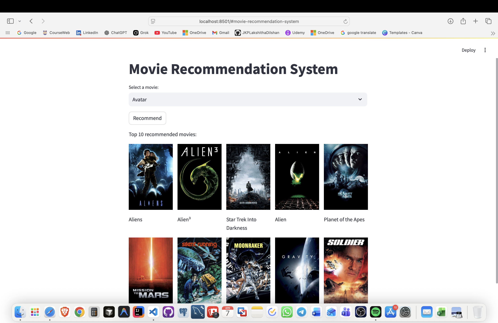

# Movie Recommendation System

A content-based movie recommendation system built with Streamlit and Python, using TMDB 5000 movies and credits datasets.

# Home page:



## Features
- Recommends movies based on user input
- Interactive web interface with Streamlit
- Utilizes TMDB 5000 dataset for recommendations
- Easy to use and extend

## Project Structure
```
├── app/
│   └── streamlit_app.py         # Main Streamlit app
├── data/
│   ├── raw/
│   │   ├── tmdb_5000_credits.csv
│   │   └── tmdb_5000_movies.csv
│   └── processed/              # Processed data (if any)
├── images/                     # Images and assets
├── notebooks/
│   └── Movie_Recommendation_System.ipynb
├── requirements.txt            # Python dependencies
├── README.md                   # Project documentation
```

## Getting Started

### Prerequisites
- Python 3.8+
- pip

### Installation
1. Clone the repository:
	```bash
	git clone https://github.com/JKPLakshithaDilshan/movie-recommendation-system.git
	cd movie-recommendation-system
	```
2. (Optional) Create and activate a virtual environment:
	```bash
	python -m venv .venv
	source .venv/bin/activate  # On Windows: .venv\Scripts\activate
	```
3. Install dependencies:
	```bash
	pip install -r requirements.txt
	```

### Running the App
```bash
streamlit run app/streamlit_app.py
```

### Data
- Place the TMDB 5000 dataset CSV files in `data/raw/`.

## Deployment
You can deploy this app using [Streamlit Community Cloud](https://streamlit.io/cloud) or any cloud platform that supports Python.

## License
This project is open source. Add your preferred license here.

## Acknowledgements
- [TMDB 5000 Movie Dataset](https://www.kaggle.com/datasets/tmdb/tmdb-movie-metadata)
- [Streamlit](https://streamlit.io/)
## Run the Streamlit App

```bash
streamlit run app/streamlit_app.py
```
